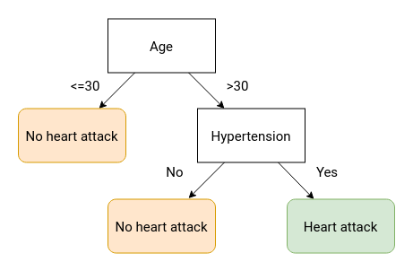
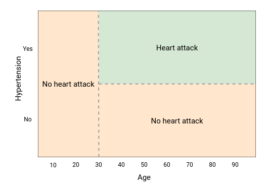
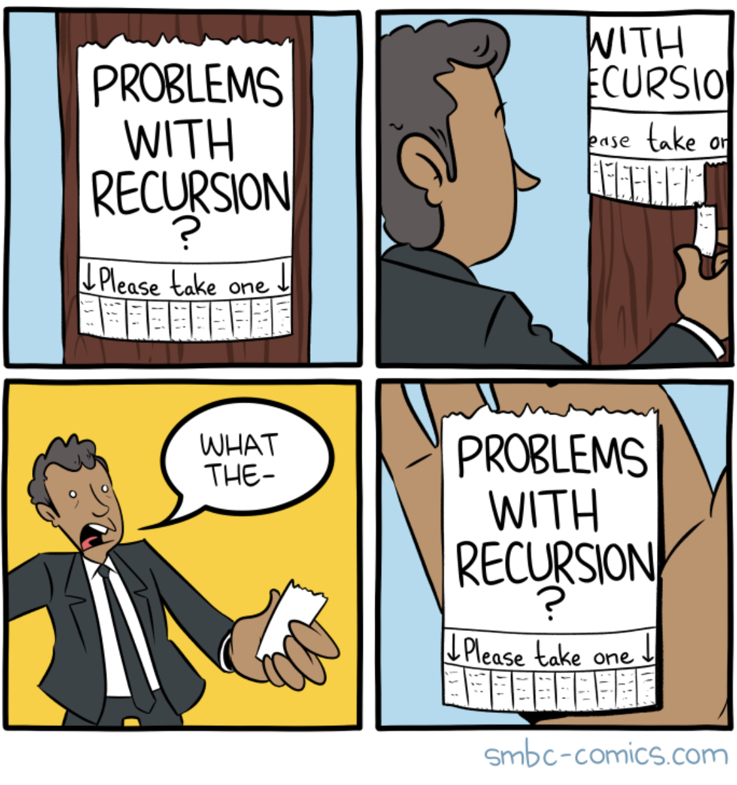

```{r setup, include=FALSE}
knitr::opts_chunk$set(echo = TRUE, message = FALSE, warning = FALSE)
```

```{r include=FALSE}
library(dplyr)
library(ggplot2)
library(viridis)
set.seed(40)
theme_set(theme_minimal())

col_palette <- list()
col_palette$green <- '#23754f'
col_palette$red <- '#ba1827'
```

<br>

## Motivation
### Parametric vs non-parametric.

What if you had data that looked like this? It's square, there's clear edges that define the classes and it's non-linear. It would be difficult to mathematically represent this data using a linear model like linear regression, logistic regression, glm, etc.

```{r para-class, echo=FALSE}
# create a two dimensional dataset
n <- 1000
.data <- tibble(X1 = runif(n, -1, 1),
                X2 = runif(n, -1, 1),
                Y = (round(X1) == round(X2)) * 1)

# plot it
.data %>% 
  mutate(Y = paste0("Class ", Y)) %>% 
  ggplot(aes(x = X1, y = X2, shape = Y)) +
  geom_point(size = 3, alpha = 0.5) +
  scale_shape_manual(values = c(1, 19)) +
  labs(shape = NULL)
```

<br><br><br><br>

You could fit a logistic regression to this model.

```{r}
mod <- glm(Y ~ X1 + X2, data = .data, family = 'binomial')
preds <- predict(mod, type = 'response') > 0.5
```

```{r echo=FALSE}
plot_classes <- function(.data, preds){
  .data %>% 
    mutate(preds = as.numeric(preds),
           correct = if_else(preds == Y, 'Correct', 'Incorrect'),
           Y = paste0("Class ", Y)) %>% 
    ggplot(aes(x = X1, y = X2, shape = Y, color = correct)) +
    geom_point(size = 3, alpha = 0.5) +
    scale_shape_manual(values = c(1, 19)) +
    scale_color_manual(values = c(col_palette$green, col_palette$red)) +
    labs(shape = NULL, color = NULL)
}

plot_classes(.data, preds)
```

<br><br><br><br>

And if you know exactly what you were doing, you could add an interaction and get slightly better results.

```{r}
mod <- glm(Y ~ X1 * X2, data = .data, family = 'binomial')
preds <- predict(mod, type = 'response') > 0.5
```

```{r echo=FALSE}
plot_classes(.data, preds)
```
<br><br><br><br>

But knowing that functional form is difficult, especially in real-world high-dimensional datasets. Decision trees perform well on these square data sets and require little model specification.


```{r}
mod_tree <- rpart::rpart(Y ~ X1 + X2, data = .data)
preds <- predict(mod_tree) > 0.5
```

```{r echo=FALSE}
plot_classes(.data, preds)
```

<br><br><br><br>

## Decision trees

We will start at the lowest building block of the decision trees – the impurity metric – and build up from there.

1. Define an impurity metric which drives each split in the decision tree  
  - We'll use entropy for this classification example. For regression, sum of squared residuals is often used.  
2. Walk through a decision algorithm to choose the best data split based on the impurity measure
3. Walk through a decision tree algorithm by recursively calling the decision algorithm

And then you can extend the tree model into more complex models like bagging, random forest, and boosting. 

<br>

### Intuition

Binary decision trees create an interpretable decision-making framework for making a single prediction. Suppose a patient comes into your clinic with chest pain and you wish to diagnose them with either a heart attack or not a heart attack. A simple framework of coming to that diagnosis could look like the below diagram. Note that each split results in two outcomes (binary) and every possible condition leads to a terminal node.



The model’s splits can also be visualized as partitioning the feature space. Since the decision tree makes binary splits along a feature, the resulting boundaries will always be rectangular. Further growing of the above decision tree will result in more but smaller boxes. Additional features (`X1, X2, ...`) will result in additional dimensions to the plot.



But where to split the data? The splits are determined via an impurity index. With each split, the algorithm maximizes the purity of the resulting data. If a potential split results in classes `[HA, HA]` and `[NHA, NHA]` then that is chosen over another split that results in `[HA, NHA]` and `[NHA, HA]`. At each node, all possible splits are tested and the split that maximizes purity is chosen.

For classification problems, a commonly used metric is Gini impurity. Gini impurity is `2 * p * (1 - p)` where `p` is the fraction of elements labeled as the class of interest. A value of `0` is a completely homogeneous vector while 0.5 is the inverse. The vector [NHA, HA, NHA] has a Gini value of `2 * 1/3 * 2/3 = 0.444`. Since Gini is used for comparing splits, a Gini value is calculated per each resulting vector and then averaged – weighted by the respective lengths of the two vectors.

$$
gini(p) = 2 * p * (1 - p)
$$

### Making a split

The Gini impurity metric. Note that the output of `gini` is constrained to `[0, 0.5]`.

```{r gini_function}
gini <- function(p){
  2 * p * (1 - p)
}
```
```{r gini_plot, fig.height=4, fig.width=8}
p <- seq(0, 1, by = 0.01)
ggplot(tibble(p, gini(p)), aes(x = p, y = `gini(p)`)) +
  geom_smooth(color = 'grey40', method = 'loess') +
  # geom_point(size = 3) +
  labs(title = "gini(p) is constrained to [0, 0.5]")
```
<br><br>

For convenience, I am going to wrap the `gini` function so we feed it a vector instead of a probability. The probability is calculated from the mean value of the vector. In practice, this vector will be binary and represent classification labels so the mean value is the proportion of labels that represent a positive classification.

```{r gini_vectors}
gini_vector <- function(X){
  # X should be binary 0 1 or TRUE/FALSE
  gini(mean(X, na.rm = TRUE))
}
X1 <- c(0, 1, 0)
gini_vector(X1)
```

And finally I am going to wrap it again so it gives us the weighted Gini of two vectors. The two vectors will be the two resulting "buckets" of observations resulting from a given split. We care about minimizing this total weighted Gini.

```{r gini_weighted}
gini_weighted <- function(X1, X2){
  # X should be binary 0 1 or TRUE/FALSE
  if (is.null(X1)) return(gini_vector(X2))
  if (is.null(X2)) return(gini_vector(X1))
  
  prop_x1 <- length(X1) / (length(X1) + length(X2))
  weighted_gini <- (prop_x1*gini_vector(X1)) + ((1-prop_x1)*gini_vector(X2))
  return(weighted_gini)
}
X2 <- c(1, 1, 1)
gini_weighted(X1, X2)
```

<br>

## Splitting

At each node, the tree needs to make a decision using the Gini metric. Here a single-dimensional grid search is performed to find the optimal value of the split for a given feature such as `X1`.

```{r optimal_split }
optimal_split <- function(X, classes, n_splits = 50){
  
  # create "dividing lines" that split X into to parts
  # a smarter version would account for X's values
  splits <- seq(min(X), max(X), length.out = n_splits)
  
  # calculate gini for each potential split
  gini_index <- sapply(splits, function(split){
    X1 <- classes[X <= split]
    X2 <- classes[X > split]
    gini_index <- gini_weighted(X1, X2)
    return(gini_index)
  })

  # choose the best split based on the minimum (most pure) gini value
  gini_minimum <- min(gini_index, na.rm = TRUE)
  optimal_split <- na.omit(splits[gini_index == gini_minimum])[1]
  
  # best prediction for these data are the means of the classes
  classes_split <- split(classes, X <= optimal_split)
  split0 <- tryCatch(mean(classes_split[[2]], na.rm = TRUE), error = function(e) NULL)
  split1 <- tryCatch(mean(classes_split[[1]], na.rm = TRUE),  error = function(e) NULL)
  preds <- list(split0 = split0, split1 = split1)
  
  return(list(gini = gini_minimum, split_value = optimal_split, preds = preds))
}
X <- c(-0.3, -0.1, 0, 0.1, 0.5)
classes <- c(1, 1, 0, 1, 0)
optimal_split(X, classes)
```


```{r optimal_split_plot, echo=FALSE, fig.height=3.5, fig.width=8}
# plot the points and the optimal split
tibble(x = X, y = 0, col = classes) %>%
  ggplot(aes(x = x, y = y, color = as.factor(col))) +
  geom_point(size = 7, alpha = 0.8) +
  geom_vline(xintercept = optimal_split(X, classes)$split_value,
             linetype = 'dashed') +
  annotate('text', x = optimal_split(X, classes)$split_value, y = 0,
           label = 'Optimal split', angle = 90, vjust = -1, hjust = -0.5) +
  scale_y_continuous(labels = NULL) +
  labs(title = 'The optimal split chosen by the Gini grid search',
       color = 'Class',
       x = 'X1',
       y = NULL)
```

The grid search needs to be expanded to search all possible features (`X1`, `X2`, `...`). The resulting smallest Gini value is the split the tree uses.

```{r best_feature_to_split}
best_feature_to_split <- function(X, Y){
  # X must be a dataframe, Y a vector of 0:1

  # get optimal split for each column
  ginis <- sapply(X, function(x) optimal_split(x, Y))
  
  # return the the column with best split and its splitting value
  best_gini <- min(unlist(ginis['gini',]))[1]
  best_column <- names(which.min(ginis['gini',]))[1]
  best_split <- ginis[['split_value', best_column]]
  pred <- ginis[['preds', best_column]]
  return(list(column = best_column, gini = best_gini, split = best_split, pred = pred))
}
n <- 1000
.data <- tibble(Y = rbinom(n, 1, prob = 0.3),
                X1 = rnorm(n),
                X2 = rnorm(n),
                X3 = rbinom(n, 1, prob = 0.5))
X <- .data[, -1]
Y <- .data[[1]]
best_feature_to_split(.data[, -1], .data[['Y']])
```

<br>

#### Recursion

To create the decision trees, the splitting algorithm should be applied until it reaches a certain stopping threshold. It is not known prior how many splits it is going to make -- the depth or the width. This is not easily solved using a `while` loop as a split results in two new branches and each can potentially split again. [Recursion](https://www.cs.utah.edu/~germain/PPS/Topics/recursion.html) is required. 

</img>

<br>
<br>

In recursive functions, the function is called within itself until some stopping criteria is met. A simple example is the [quicksort](https://algs4.cs.princeton.edu/23quicksort/) algorithm which sorts a vector of numbers from smallest to greatest. 

Quicksort is a divide-and-conquer method that splits the input vector into two vectors based on a pivot point. Points smaller than the pivot go to one vector, points larger to the other vector. The pivot point can be any point but is often the first or last item in the vector. The function is called on itself to repeat the splitting until one or less numbers exist in the resulting vector. Then these sorted child-vectors are passed upward through the recursed functions and combined back into a single vector that is now sorted. 

```{r quicksort}
quick_sort <- function(X){
  
  # stopping criteria: stop if X is length 1 or less
  if (length(X) <= 1) return(X)
  
  # create the pivot point and remove it from the vector
  pivot_point <- X[1]
  X_vec <- X[-1]
  
  # create the lower and upper vectors
  lower_vec <- X_vec[X_vec <= pivot_point]
  upper_vec <- X_vec[X_vec > pivot_point]
  
  # call the function recursively
  lower_sorted <- quick_sort(lower_vec)
  upper_sorted <- quick_sort(upper_vec)
  
  # return the sorted vector
  X_sorted <- c(lower_sorted, pivot_point, upper_sorted) 
  return(X_sorted)
}
X <- rnorm(20)
quick_sort(X) %>% plot()
```

You can implement the above splitting algorithm as a recursive function which builds our decision tree classifier. The tree will stop if it exceeds a certain depth, a minimum number of observations result from a given split, or if the Gini measure falls below a certain amount. Only one of these methods is required however including all three allow additional hyperparameter tuning down-the-road.

The function would recursively calls the `best_feature_to_split()` function until one of the stopping criteria is met. All other code is to manage the saving of the split decisions. The output is a dataframe denoting these decisions.

The result will be a tree that looks similar to the basic R implementation:

```{r tree-plot}
rpart.plot::rpart.plot(mod_tree)
```

**Go to https://www.marlo.works/posts/random-forest/#recursive-branching for the R code to build your own bagging and random forest models using recursion**

<br>

### Where trees struggle

Trees will struggle when the feature space is dissected at an angle by the classification value. Since regression trees are partitioning the feature space into rectangles, the tree will need to be deeper to approximate the decision boundary.

The below data's classification is in two separate triangles: top left and bottom right of the plot. A logistic regression finds the boundary easily.

```{r}
# create a two dimensional dataset
n <- 1000
.data <- tibble(X1 = runif(n, 0, 1),
                X2 = runif(n, 0, 1),
                Y = (X1 > X2) * 1)
# plot it
.data %>% 
  mutate(Y = paste0("Class ", Y)) %>% 
  ggplot(aes(x = X1, y = X2, shape = Y)) +
  geom_point(size = 3, alpha = 0.5) +
  scale_shape_manual(values = c(1, 19)) +
  labs(shape = NULL)
```
<br><br><br><br>

```{r}
# decision tree
mod_tree <- rpart::rpart(Y ~ X1 + X2, data = .data, control = rpart::rpart.control(maxdepth = 2))
preds <- predict(mod_tree) > 0.5
```

```{r echo=FALSE}
# mod_tree
plot_classes(.data, preds) +
  geom_hline(yintercept = 0.42) +
  geom_segment(x = 0.73, xend = 0.73, y = 0.42, yend = 1) +
  geom_segment(x = 0.21, xend = 0.21, y = 0.42, yend = 0)
```
```{r}
rpart.plot::rpart.plot(mod_tree)
```


<br><br><br><br>

```{r}
# logistic regression
model_log <- glm(Y ~ X1 + X2, data = .data, family = 'binomial')
preds <- predict(model_log, type = 'response') > 0.5 
```

```{r echo=FALSE}
plot_classes(.data, preds) +
  geom_abline(slope = 1, intercept = 0)
```
<br><br><br><br>

> Levers you can pull:  
> - **Tree depth**: how many levels of splits  
> - Or **minimum number of observations** to continue splitting  
> - Or **complexity parameter**: decrease in entropy required to consider split  


<br>

## Bagging

Single decision trees are prone to overfitting and can have high variance on new data. A simple solution is to create many decision trees based on resamples of the data (with replacement) and allow each tree to “vote” on the final classification. This is bagging. The process keeps the low-bias of the single tree model but reduces overall variance.

The “vote” from each tree is their prediction for a given observation. The votes are averaged across all the trees and the final classification is determined from this average. The trees are trained on bootstrapped data – taking repeated samples of the training data with replacement.

For regression:  $\frac{1}{B}\sum_{i=1}^{B} f_b(x')$

Or for classification, you can also take the majority vote rather than average the predicted probabilties.

> Levers you can pull:  
> - **All the decision tree levers**  
> - **Number of trees**  
> - **Size of samples** to draw  

**Go to https://www.marlo.works/posts/random-forest/#bagging for the R code to build your own bagging model**

<br>

## Random forest

Random forest is like bagging except in addition to bootstrapping the observations, you also take a random subset of the features at each split. The rule-of-thumb sample size is the square root of the total number of features.

> Levers you can pull:  
> - **All the decision tree levers**  
> - **Number of trees**  
> - **Number of features** to consider for a given tree  

**Go to https://www.marlo.works/posts/random-forest/#random-forest for the R code to build your own random forest model**

<br>

## Boosting

Another tree ensemble method that is extremely popular. Boosted models fit the trees sequentially, with each following tree fitted on the residuals on the previous tree. All these trees are summed together -- versus averaged liked in bagging or random forest models. 

Each tree is "shallow" or considered a "weak learner." This makes it less prone to overfitting but a given tree has high variance.

> Levers you can pull:  
> - All the decision tree levers  
> - **Number of trees**  
> - **Number of rounds**: Number of passes of the data  
> - **Eta**: the learning rate. The scale of the contribution of the current tree. Lower == slower compute but lower variance  

`adaboost` and `xgboost` are popular implementations of boosting. They're generally similar except `xgboost` trees tend to grow larger while `adaboost` stays relatively the same size.

<br>

## Model comparison on real world data

!TODO

```{r}
credit <- readr::read_csv('https://raw.githubusercontent.com/joemarlo/regression-trees/main/workshop/data/credit_card.csv')
```

```{r echo=FALSE}
credit %>% 
  mutate(across(everything(), round, digits = 2)) %>% 
  # head()
  reactable::reactable()
```


```{r}
# create train test split
X <- select(credit, -Class)
Y <- credit$Class
indices <- sample(c(TRUE, FALSE), size = nrow(credit), replace = TRUE, prob = c(0.5, 0.5))
X_train <- X[indices,]
X_test <- X[!indices,]
Y_train <- Y[indices]
Y_test <- Y[!indices]
```

```{r}
# fit the bagged model
model_bag <- ipred::bagging(Class ~ ., data = credit[indices,])
preds <- predict(model_bag, newdata = credit[!indices,])
table(preds > 0.5, Y_test)
```


```{r}
# fit a random forest
model_ranger <- ranger::ranger(Class ~ ., data = credit[indices,], num.trees = 50, 
                               max.depth = 10, importance = 'impurity')
preds <- predict(model_ranger, data = X_test)$predictions
table(preds > 0.5, credit$Class[!indices])
```

```{r message=FALSE, warning=FALSE}
# fit an xgb
model_xgb <- xgboost::xgboost(data = as.matrix(X_train), label = Y[indices], objective = "binary:logistic",
                              max.depth = 2, eta = 1, nthread = 2, nrounds = 2)
preds <- predict(model_xgb, newdata = as.matrix(X_test))
table(preds > 0.5, credit$Class[!indices])
```

<br><br><br>

#### Feature importance

Ensemble trees are easily interpretable like a single decision trees or like a linear regression model. There are no coefficients. `Importance` is a metric often used to size up a given feature's influence / impact / importance on the final predictions. It is calculated many different ways but they generally consider:  
- How often a spit is made using a given feature  
- How much entropy is reduced when splitting on a given feature  

```{r importance plot}
ranger::importance(model_ranger) %>% 
  tibble::enframe() %>% 
  ggplot(aes(x = reorder(name, -value), y = value)) +
  geom_col() +
  labs(title = 'Variables ranked by importance',
       x = NULL,
       y = 'Importance') +
  theme(axis.text.x = element_text(angle = -40, hjust = 0))
```


<br><br><br><br>


## Final thoughts

**Benefits of tree methods**:

- Single trees are easy to explain and interpret
- Allows for both classification and regression
  - For regression, replace the Gini impurity measure with variance of the outcome variable
- Allows for binary, continuous, and categorical (with dummy coding) variables
- Can handle missing data **if data is not used within a branch**
- Ensemble methods are computationally parallel'izable
- No need to specify parametric form  


**Downsides**:  

- Single trees are easy to overfit  
- Single trees have high variance  
- Ensemble methods are difficult to interpret


<br><br><br><br><br>

## Additional resources

**Tree methods**:  
- [StatQuest regression trees](https://www.youtube.com/watch?v=g9c66TUylZ4)  
- [StatQuest CART](https://www.youtube.com/watch?v=_L39rN6gz7Y)  
- [xgboost](https://xgboost.readthedocs.io/en/latest/tutorials/model.html)  
  
