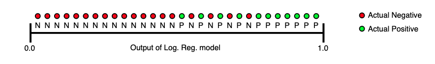

```{r setup, include=FALSE}
knitr::opts_chunk$set(echo = TRUE)
```


## Metrics

### Accuracy

$Accuracy = \frac{TP+TN}{TP+TN+FP+FN}$

or $mean(Y == \hat{Y})$

### Precision

$Precision = \frac{TP}{TP+FP}$

### Recall

$Recall = \frac{TP}{TP+FN}$


### AUC

AUC is just the true positive rate and false positive rate plotted at difference classification threshold, a curve is drawn, and the area under that curve is calculated.


OR you can interpret the value as the probability of that the model ranks a random positive result higher than a random negative result


^[Google Developers]

### Log loss

A method to penalize unsure models

$log loss = -\log(\prod_{i=1}^{N} (|\hat{Y_i} - (1-Y_i|))$

Step one: Model predicts probabilities: [0.7, 0.3, 0.2] with the true class [1, 1, 0]
Step two: Calculate likelihood: 0.7 * 0.3 * (1 - 0.2) = 0.168
Step three: Log transform so its easier to keep track of small values: log(0.168) = -1.783791
Step four: Inverse so lower loss score is better: -(-1.783791) = 1.783791

0 log loss is perfect


## yardstick (max kuhn)

```{r}
# ensure the fitting Rmd output is in the console
# source('R/3-fitting.Rmd')

# already established our metrics in `our_metrics`

autoplot(credit_grid) + 
  labs(title = 'Cross-validation results', 
       y = NULL)
```

```{r}
# look at the metrics
purrr::map(credit_grid$result, ~show_best(.x, metric = 'roc_auc'))
purrr::map(credit_grid$result, ~select_best(.x, metric = 'roc_auc'))

# or rank all of them 
rank_results(credit_grid, rank_metric = "roc_auc")
```

### Calibration


```{r}
# pick a model
y_hat_xgb <- credit_grid %>%
    workflowsets::extract_workflow('complex_boost') %>%
    # extract_workflow_set_result("complex_glm") %>%
    # select_best(metric = 'roc_auc') %>%
    tune::finalize_workflow(parameters = tibble(trees = 500, tree_depth = 3)) %>%  # no parameters for glm
    parsnip::fit(data = train) %>% 
    predict(new_data = train, type = 'prob')
```

```{r}
# bin the predictions
plot.data <- y_hat_xgb %>% 
    transmute(y_hat = .pred_bad,
              y = as.numeric(train$Status == 'bad')) %>% 
    mutate(calibration = round(100*y_hat)) %>% 
    group_by(calibration) %>% 
    summarize(model.estimate = mean(y_hat),
              empirical.estimate = mean(y))

# plot it
plot.data %>% 
    ggplot(aes(x = model.estimate, y = empirical.estimate)) +
    geom_abline(slope = 1, intercept = 0, linetype = 'dashed', color = 'grey50') +
    geom_point(alpha = 0.5) +
    scale_x_continuous(breaks = seq(0, 1, by = 0.1)) +
    scale_y_continuous(breaks = seq(0, 1, by = 0.1)) +
    labs(title = "Calibration: Observed status vs predicted",
         subtitle = 'Points along the 45 degree line indicate well matched predictions',
         x = "Model estimated probability of status (midpoint)",
         y = "Empirical probability of status")
```

## Final model

```{r}
# extract the best model and retrain on all the train data
best_mod <- credit_grid %>%
    workflowsets::extract_workflow('complex_glm') %>% 
    # extract_workflow_set_result("complex_glm") %>%
    # select_best(metric = 'roc_auc') %>%
    tune::finalize_workflow(parameters = tibble()) %>%  # no parameters for glm
    parsnip::fit(data = train)
```

```{r}
# make final predictions on test set
y_hat_test <- predict(best_mod, new_data = test, type = 'prob')

# final metrics
preds <- tibble(
    truth = test$Status,
    predicted = predict(best_mod, new_data = test)$.pred_class,
    bad = y_hat_test$.pred_bad,
    good = y_hat_test$.pred_good
)

yardstick::metrics(preds, truth, predicted)
yardstick::roc_auc(preds, truth, bad)
yardstick::accuracy(preds, truth, predicted)
yardstick::mn_log_loss(preds, truth, bad)
# our_metrics(preds, truth, predicted, bad)

# plot AUC
roc_curve(preds, truth, bad) %>%
    ggplot(aes(x = 1 - specificity, y = sensitivity)) +
    geom_path() +
    geom_abline(lty = 3) +
    coord_equal() 
    # add title
```

